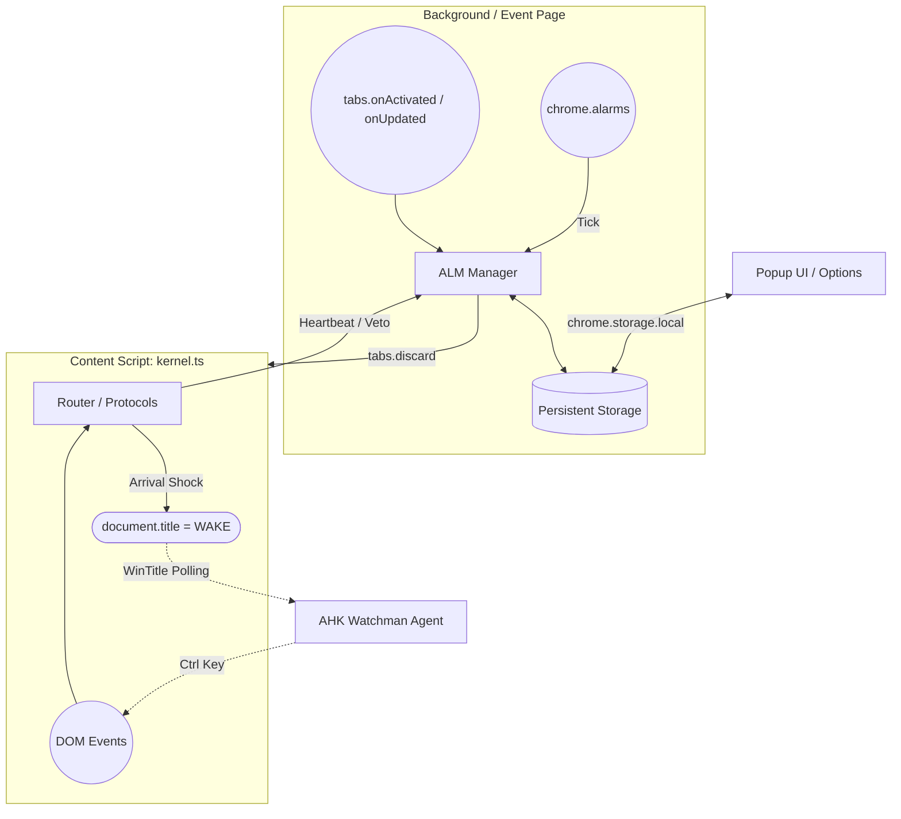

# X-Ops Walker: Architecture & Contributor Guide (v2.0.0)

このドキュメントは、X-Ops Walker の中核となるアーキテクチャ、DOM干渉の哲学、および新しいドメイン（サイト固有の挙動）を追加する際のルールを解説します。コントリビュータは、コードを追加したりIssueを立てたりする前に必ず本ドキュメントを一読してください。私たちは堅牢性とセキュリティを妥協なく追求する環境を構築しています。

---

## 1. プロジェクトのフェーズとロードマップ (Roadmap)

X-Ops Walker は v1 系（システム基盤・Universal 機能の完成）を終え、いよいよ v2 系（ドメイン特化型プロトコル・Domain-Specific Protocols の実装）フェーズへ突入します。
v2 系の最大の目標は「ドメイン特化型知能（Domain-Specific Protocols）の統合」です。

- **v2.0.0**: Context-Aware UI の実装（ポップアップのドメイン適応化） ※完了済
- **v2.1.x**: X Timeline Walker の実装（Right Column Dashboard、巡回ロジック等） ※完了済
- **v2.2.x**: Gemini Walker の実装
- **Future**: 複雑な詳細設定の `options.html` への分離

---

## 2. v2系の基本方針（Architecture Principles for v2）

v2 系の開発において、以下の3つの機能設計原則を厳守します。

- **ルーター・パターンの徹底 (Isolation)**: `kernel.ts` は「交通整理（ルーター）」と「Universal機能（SafetyEnter等）」の実行に専念する。特定のURL（XやGeminiなど）に依存する複雑なDOM操作やロジックは絶対に `kernel.ts` に混入させず、必ず `src/protocols/` ディレクトリ配下の専用モジュール（`x-timeline.ts` 等）へ委譲・隔離する。
- **Context-Aware UI (文脈適応型ポップアップ)**: `popup.html` および `popup.ts` は、現在アクティブなタブのURLを検知し、そのドメインに関連する設定項目（プロトコルのトグルなど）だけを動的に表示する。これによりUIの肥大化を防ぎ、ユーザーに文脈に合った操作を提供する。
- **Storage の区画整理 (Compartmentalization)**: `chrome.storage.local` のデータ構造はドメインごとに明確に分離する。システム基盤（`alm`）と、各プロトコル専用の設定（`xWalker`, `geminiWalker` 等）が互いに干渉しないように設計する。

---

## 3. 思想：Gatekeeper と Protocol の分離
X-Ops Walker は、明確に責務が分かれた3層構造を採用しています。特定のWebサイトのDOMに直接依存したダーティなハックが、他のタブやブラウザ全体の安定性を損なうことを防ぐためです。

- **Kernel (Gatekeeper)**: 絶対的防壁。ブラウザネイティブのイベントを最上流で奪い、安全か（入力欄ではないか等のXray-safe判定）を確認し、最適なスクロールコンテナを特定します。
- **Router (Dispatcher)**: 現在のURLを見て、どの Protocol に処理を任せるかを決める交通整理役です。
- **Protocols (Actions)**: 「Wを押したらスクロールする」「特定のサイトでZを押したら一番下に移動する」といった、具体的な振る舞いの定義（ロジック層）です。

---

## 4. 次世代タブライフサイクル管理 (ALM / Smart Tab Discard)
v1.3.2 において、拡張機能はタブのメモリライフサイクルを完全に掌握するための革新的なアプローチ（Adaptive Lifecycle Management - ALM）を確立しました。

### 4.1. コア機能の名称と定義
アーキテクチャおよびソースコード全体において、以下の厳密な定義を使用します。
- **Execution Dormancy**: ブラウザ（Chromium / Firefox）が不要と判断して勝手に行う「プロセス凍結/安楽死」。これは拡張機能の JavaScript が発火しなくなる「敵」です。
- **Smart Tab Discard**: X-Ops Walker が自らの意思とタイマーによって意図的に行う「メモリ解放（`chrome.tabs.discard`）」。我々が支配する休眠です。（旧称：Strategic Hibernation）
- **Vital Heartbeat**: 入力中やメディア再生中等に発する「絶対生存信号」。これにより Smart Tab Discard が Veto（拒否）されます。

### 4.2. Background-Driven アーキテクチャへの移行
初期実装では Content Script（`kernel.ts`）からの報告に依存して非アクティブ時間を記録していましたが、通信の瞬断やページロード遅延による「漏れ」が多発したため、v1.3.1 以降は **完全に Background スクリプト主導の中央集権型** へ移行しました。

- **状態監視の純化**: `chrome.tabs.onActivated` と `onUpdated` を直接リッスンし、タブの遷移をブラウザネイティブAPIでミリ秒単位で捕捉します。
- **Timer の OS 化**: `setInterval` などの不安定な仮想タイマーを廃止し、OSレベルで発火が保証される **`chrome.alarms`** へ換装しました。

### 4.3. 永続化レイヤー (Persistent Storage Layer)
Manifest V3 (MV3) アーキテクチャにおいて、Chrome の Service Worker や Firefox の Event Page は頻繁にサスペンド（休止）されます。
これによる `almStates` (Map) の「記憶喪失」と「タイマーリセットループ」を防ぐため、以下のロジックが組み込まれています。

- すべての状態遷移（タブ切り替え、Veto等）の末尾で `saveAlmStatesToStorage()` を経由し、状態を即座に `chrome.storage.local` (JSON) へコミット。
- Background 起動（WakeUp）の瞬間に `loadAlmStatesFromStorage()` で記憶を復元し、前回の続きから正確に猶予時間（1分/8分）を計算して Discard を完遂させます。

### 4.4. ネイティブ・シンビオシス: Arrival Shock (AHK連携)
ブラウザの深い Execution Dormancy の壁を破るため、外部ツールとの連携設計を根本から転換しました。
定期的に ControlSend を送る「定期パルス」方式はリソースの無駄であり無力であると結論付け、**「Arrival Shock (オンデマンド覚醒)」** 方式へシフトしました。

**Mechanism:**
1. ユーザーが Discard されたタブを開き、再読み込みが走り、`kernel.ts` が起動 (Pure Rebirth) した瞬間。
2. 0.5秒間だけ限定的に `document.title` の先頭に **`[WAKE]`** というシグナルを付与します。
3. 外部の AHK スクリプト（Watchman Agent）が WinTitle をポーリングしており、`[WAKE]` を検知した瞬間に一度だけ「物理的な Ctrl キー空打ち」を送り込み、DOMへの完全なフォーカスを拡張機能に引き渡します。

### 4.5. Command & Control (UI同期の動的化)
ポップアップUIにおける ALM 設定 (`alm.enabled`, `alm.ahkInfection`, `alm.heavyDomains`) の変更はすべて `chrome.storage.local` へ書き込まれます。
Background および Kernel は `chrome.storage.onChanged` を通じてこの変更を即座に捉え、マスターアラームの生成/破棄や、Arrival Shock の有効/無効をリアルタイムに切り替えます。

---

## 5. システム構成図 (Mermaid)



---

## 6. ディレクトリ構造と各ファイルの役割

```plaintext
src/
 ├── content/
 │    ├── kernel.ts          # 【コア】防壁エンジン・Arrival Shock
 │    ├── router.ts          # 【ルーター】URLベースのプロトコル切り替え
 │    └── protocols/         # 【振る舞い】サイトごとの個別ロジック
 │         ├── base.ts       # デフォルトの汎用アクション (W/S/A/D/Z等)
 │         ├── safety-enter.ts # 【Middleware】Chat SafetyEnter
 │         ├── x-timeline.ts # 【ドメイン等化】X Timeline Walker (v2.1)
 │         ├── gemini-walker.ts # 【ドメイン等化】Gemini Walker (v2.2)
 │         └── ai-chat.ts    # AIチャット専用の最適化
 ├── background.ts           # 【中枢】状態管理・ALM・Smart Tab Discard監視
 ├── popup.ts                # 【UI】Command & Control ロジック
 └── options/                # 詳細設定ページ
```

### 🛡️ [kernel.ts](file:///c:/Users/Predator/Desktop/FoxWalkerExt/src/kernel.ts) (The Gatekeeper)
ブラウザのEvent Captureフェーズの最上流（`window.addEventListener(..., {capture: true})`）に常駐し、SPAの独自リスナーよりも**先**にキーボードイベントを捕捉します。

#### 重要な関数と採用ロジックの背景（Why & What）:
- **[isOrphan()](file:///c:/Users/Predator/Desktop/FoxWalkerExt/src/kernel.ts#100-115)**: 
  - **Why**: 拡張機能のアップデート時やリロード時に、古い注入済みスクリプト（亡霊）と新しいスクリプトが同一タブ内で競合し、二重実行されるのを防ぐため。
  - **What**: イベントリスナーの先頭で強制的に `chrome.runtime.getManifest()` を呼び出し、例外（Extension context invalidated）が発生した場合は即座に自身を抹消し、以降の実行を無効化します。
- **[shouldPassThrough(event)](file:///c:/Users/Predator/Desktop/FoxWalkerExt/src/kernel.ts#307-336)**: 絶対的パススルー層。
  - **Why**: コピー（Ctrl+C）やIMEの日本語変換中など、OSやブラウザが当然処理すべきユーザーのアクションをWalkerが妨害してしまう最悪のUXを避けるため。
  - **What**: 「IME入力の特定コード（Chromeの Process、Firefoxの 229）」「テキスト選択中」「修飾キーのみの押下」などを網羅的にチェックし、合致すれば即座に干渉を止めます。
- **[isInputActive(event)](file:///c:/Users/Predator/Desktop/FoxWalkerExt/src/kernel.ts#282-306)**: 
  - **Why**: Firefox特有の「Xray Wrappers」というセキュリティ境界が存在し、`instanceof Element` などの型チェックはコンテキスト違いで false になるため。
  - **What**: 拡張機能の安全領域からページのDOMに触れる際、純粋なDOMプロパティである `node.nodeType === 1` などの判定法を用いたXray-safeな入力欄ハイジャック判定です。（絶対に型チェックに戻してはいけません）。
- **[getBestScrollContainer(event)](file:///c:/Users/Predator/Desktop/FoxWalkerExt/src/kernel.ts#78-99)**: ハイブリッド・スクロール探知エンジン。
  - **① Event Path探索 (composedPath)**: RedditなどのShadow DOM内で発生したイベントから、直近の親コンテナを一発で特定する。
  - **② Active Element探索 (getScrollParentPiercing)**: Geminiのように「固定フッター（入力欄）」の兄弟要素にスクロールがある場合、フォーカス位置から上へ遡る。
  - **③ Center Raycast探索 (elementFromPoint)**: 画面中央からの逆探知・Shadow Boundaryを貫通してスクロール親を見つけ出す最終兵器。
- **[normalizeKey(event)](file:///c:/Users/Predator/Desktop/FoxWalkerExt/src/kernel.ts#667-675)**: 
  - **Why**: ユーザーのキーボードレイアウト（US/JIS等）やOSによって `event.key` の出力がブレるため。
  - **What**: 物理的な配置を優先する `event.code` をベースにパースし、修飾キー（Shift等）に依存しない常に小文字の確実な文字列表現（例: `'a'`, `'w'`, `' '`）を生成します。
- **【特権】`Alt+Z` (緊急フォーカス奪還コマンド)**: 
  - **Why**: 複雑なSPA（閉じたShadow DOM内や見えない入力フィールド）において、フォーカスが抜け出せなくなり、Walkerの操作が完全に麻痺する「詰み」状態を打破するため。
  - **What**: リスナーの最上段（[shouldPassThrough](file:///c:/Users/Predator/Desktop/FoxWalkerExt/src/kernel.ts#307-336) やルーター委譲より**前**）に位置し、強制的に [deepBlur](file:///c:/Users/Predator/Desktop/FoxWalkerExt/src/kernel.ts#645-660) と `document.body.focus()` を呼び出します。これにより「無主フォーカス」を消滅させ、確実に操作主体をWalkerに取り戻します。

### 🔀 [router.ts](file:///c:/Users/Predator/Desktop/FoxWalkerExt/src/router.ts) (The Dispatcher)
[DomainProtocol](file:///c:/Users/Predator/Desktop/FoxWalkerExt/src/router.ts#1-7) インターフェースを定義し、Chain of Responsibility（責任の連鎖）パターンでキーボードイベントを処理します。マッチする特化プロトコルが処理を完遂（`true`を返却）すればそこで終了し、未処理（`false`）であれば [base.ts](file:///c:/Users/Predator/Desktop/FoxWalkerExt/src/protocols/base.ts) へフォールバックします。

### 📜 [protocols/base.ts](file:///c:/Users/Predator/Desktop/FoxWalkerExt/src/protocols/base.ts) (Universal Actions)
汎用的なウェブサイトで動作するデフォルトのキーバインド群です。UIのトグル（Fキー等）はハードコードせず、`CustomEvent` を `window` にディスパッチし、[kernel.ts](file:///c:/Users/Predator/Desktop/FoxWalkerExt/src/kernel.ts) 側で拾わせる疎結合（Event-Driven）設計を採用しています。

---

## 7. 現在のキーバインド一覧 (Base Protocol)

以下は、いかなる特化プロトコルにも該当しない場合（[base.ts](file:///c:/Users/Predator/Desktop/FoxWalkerExt/src/protocols/base.ts)）のデフォルトマッピングです。

| キー | （単押し）アクション | Shift + キー（修飾あり） アクション |
| :--- | :--- | :--- |
| **W** | スクロールアップ (画面の約80%) | ページの**最上部**へスクロール |
| **S** | スクロールダウン (画面の約80%) | ページの**最下部**へスクロール |
| **A** | **前のタブ**へ移動 | （なし） |
| **D** | **次のタブ**へ移動 | （なし） |
| **Space** | **次のタブ**へ移動 | **前のタブ**へ移動 |
| **Q** | 履歴 **戻る** (Back) | （なし） |
| **E** | 履歴 **進む** (Forward) | （なし） |
| **Z** | DOMフォーカスリセット & **最上部**へスクロール | 閉じたタブを開く (Undo Close) |
| **Alt + Z** | 【特権コマンド】緊急フォーカス奪還 & 最上部へ | - |
| **F** | チートシート（HUD）の表示/非表示トグル | （なし） |
| **X** | （なし） | 現在のタブを**閉じる** |
| **R** | （なし） | 現在のタブを**リロード** |
| **M** | （なし） | 現在のタブを**ミュート/解除** |
| **G** | （なし） | **他のタブを破棄**（メモリ解放: Discard Other） |
| **T** | （なし） | 全てのタブを**クリーンアップ**（ピン留め・再生中除く）|
| **9** | （なし） | **最初のタブ**（左端）へ移動 |
| **C** | （なし） | 現在のタブを**複製**（Duplicate） |
| **Esc** | Walker モードの **ON/OFF** トグル（※[kernel.ts](file:///c:/Users/Predator/Desktop/FoxWalkerExt/src/kernel.ts)処理） | - |

*(※注: [ai-chat.ts](file:///c:/Users/Predator/Desktop/FoxWalkerExt/src/protocols/ai-chat.ts) が適用されるようなドメインでは、「Zキーを押すとページ最下部へ移動する」といったプロトコルによるオーバーライドが存在します)*

---

## 8. 拡張ルール：新しいドメインプロトコルを追加するには

X.com や YouTube など、特定のサイト専用の特殊な操作（Domain Protocols）を追加する場合は、以下の厳格なルールに従ってください。

### ❌ 絶対にやってはいけないこと (DON'Ts)
- **[kernel.ts](file:///c:/Users/Predator/Desktop/FoxWalkerExt/src/kernel.ts) を汚染しない**: 特定のURL（ホスト名）に依存する分岐を [kernel.ts](file:///c:/Users/Predator/Desktop/FoxWalkerExt/src/kernel.ts) 内に絶対に書いてはいけません。
- **`addEventListener` を自前で書かない**: プロトコル内で独自に [keydown](file:///c:/Users/Predator/Desktop/FoxWalkerExt/src/kernel.ts#677-757) などをリッスンしないでください。入力欄ハイジャックなどのバグが再発します。
- **DOMのセキュリティ判定を再発明しない**: [isInputActive](file:///c:/Users/Predator/Desktop/FoxWalkerExt/src/kernel.ts#282-306) のようなチェックはプロトコル内で行う必要はありません。ルーターから渡された時点で、それはすでに「安全なキー操作」であることが Kernel によって保証されています。

### ⭕ 正しい追加手順 (DOs)
1. `src/protocols/` ディレクトリに新しいファイル（例: `x-timeline.ts`）を作成します。
2. `DomainProtocol` インターフェースを実装するクラスを作成します。
```typescript
import { DomainProtocol } from '../router';

export class XTimelineProtocol implements DomainProtocol {
    matches(hostname: string): boolean {
        // マッチさせたい正規表現や文字列検索
        return hostname === 'x.com' || hostname === 'twitter.com';
    }

    handleKey(event: KeyboardEvent, key: string, shift: boolean, container: Element): boolean {
        if (key === 'j') {
            // 次のツイートへ移動する独自のDOMロジック
            return true; // 処理を完遂した場合は必ず true を返す
        }
        // W や S など、自分が関知しないキーは false を返し、BaseProtocol にフォールバックさせる
        return false; 
    }
}
```
3. 作成したプロトコルを `kernel.ts` の上位でルーターに登録（`router.register(new XTimelineProtocol())`）します。
4. UIの変更が必要な場合は、プロトコル内で直接 DOM を生成するのではなく、`CustomEvent` を発行して Kernel 層や UI コンポーネント層に処理を依頼してください。

---

## 9. 汎用設定（General Settings）拡張のガイドライン

今後プロジェクトに、特定の1つのサイトではなく、「複数のサイト」または「全サイト」にまたがって動作するような機能フラグ（例：「SafetyEnter設定」「動画倍速汎用化」など）を追加する場合のルールです。

1. **Kernelフラグの乱用禁止**:
   `kernel.ts` はあくまでイベントの「門番」です。「設定AがOnならこうする」といった特定のフィーチャーフラグを `kernel.ts` の上位層に書き込まないでください。
2. **「Middleware（ミドルウェア）プロトコル」としての実装**:
   もし「特定の数サイト」または「すべてのサイト」に介入する機能であれば、新たにミドルウェアとして動作する `Protocol` を作成してください（例: `src/protocols/safety-enter.ts`）。
3. **ルーターの連鎖 (Chain) を活用する**:
   ミドルウェアプロトコルは、`matches` で広範囲に `true` を返させます。その後 `router.ts` にて、**ほかのドメイン特化プロトコルよりも前**（あるいは意図する優先順位）に登録します。
   - もしそのミドルウェアがキーアクションを捕捉して処理（条件付きブロックなど）した場合は `true` を返し、伝播を止めます。
   - 処理しなかったキーについては `false` を返し、次のプロトコル（AI Chatなど）やBaseへ流します。

これにより、一切 `kernel.ts` を汚すことなく、強力な汎用機能を全ドメインに安全にデプロイし、トグル可能にすることができます。プラグインのように扱ってください。

---

## 10. 🛡️ Domain Protocol Development Rules (ドメインプロトコル開発要件)

各サイト（X.com等）に特化した戦術機能（Domain Protocol）を開発・追加する際は、v2.1.7の教訓に基づき以下のルールを厳守すること。

### State Isolation (状態の完全隔離):

プロトコル内のWalker機能（歩兵）とDashboard機能（司令室）の起動スイッチ（isActive, isDashboardEnabled等）は完全に分離し、PhantomState (chrome.storage.local) からの変更通知 (onChanged) によってのみ状態を同期すること。

### DOM Traversing & Injection (安全なDOM操作):

対象サイトのDOMは常に変化する前提（React等による再描画）で設計する。

要素の挿入は単純な appendChild や insertAdjacentHTML ではなく、maintainDOM（Heartbeat）と Smart Pillar（見えない柱による兄弟要素検知）を用いて、既存のレイアウトを破壊せずに空間を確保すること。

### Cross-Browser Strictness (Firefox Isolated World 制約への対応):

コンテンツスクリプト内で拡張機能APIを呼ぶ際、絶対に (window as any).chrome を使用してはならない。

Firefoxの厳格なセキュリティ（Isolated World）でクラッシュを防ぐため、必ず純粋なグローバル変数である chrome.storage や chrome.i18n を直接呼び出すこと。

### URL Handling (SPAと絶対パスの強制):

SPA（Single Page Application）特有の相対パス誤認を防ぐため、DOMの href に注入するURLは必ず https:// から始まる絶対URLに変換（Enforcement）してから扱うこと。内部の照合処理には cleanUrl() を用いて統一する。

---

## 11. 🪟 Tactical Cheat Sheet Standardization (ドメイン別チートシートの標準化)

ドメインプロトコルごとに実装される専用チートシート（Hキー等で起動）は、システム標準のゼネラルUI（PhantomUI）と完全にデザイン言語を統一すること。

### Glassmorphism Design:

背景: rgba(15, 15, 20, 0.85) / backdropFilter: 'blur(12px)'

角丸・影: borderRadius: '12px', boxShadow: '0 8px 32px rgba(0,0,0,0.6)'

### Keycap UI (キーボード装飾):

ショートカットキーの表示には必ず `<kbd>` タグを使用し、立体的なキーキャップデザイン（オレンジ文字＋半透明白背景＋ボーダー）を適用すること。

### i18n Mandatory (多言語対応の義務化):

UI内のテキスト（タイトル、アクション説明、閉じるボタンの案内など）のハードコードは厳禁とする。

必ず `chrome.i18n.getMessage()` を使用し、 `_locales/en/messages.json` および `_locales/ja/messages.json` にキーを登録して動的に読み込むこと。

## 12. 🎛️ Options Page Implementation Rules (コントロールセンター実装要件)

`options.html` は単なる設定画面ではなく、戦術データを管理する「コントロールセンター」として機能させる。

### Full-Tab Experience:

OptionsページはPopupではなく独立したタブとして開かれることを前提としたUX（十分な余白、X Dark Modeに準拠したテーマ）で設計する。

外部ツールでの「現在のタブを追加」のようなコンテキストに合わない機能は排除し、データ入力の入り口は実際の戦術画面（Dashboard内の`Quick Add`等）に委譲する。

### Data Manipulation (リストデータの管理原則):

ブックマーク等のリストデータを扱う場合、「削除」だけでなく、後から視認性を高めるための「インライン編集（リネーム）」と、巡回順序を制御するための「並び替え（↑/↓）」機能を必ず実装すること。

### Zero-Latency Sync (即時同期):

Optionsページでの変更（編集・並び替え・削除）は即座に `chrome.storage.local` に保存すること。

コンテンツスクリプト側は `chrome.storage.onChanged` をリッスンし、リロードなし（Zero-Latency）で即座にダッシュボードやUIに最新のリストを再描画するアーキテクチャを維持すること。